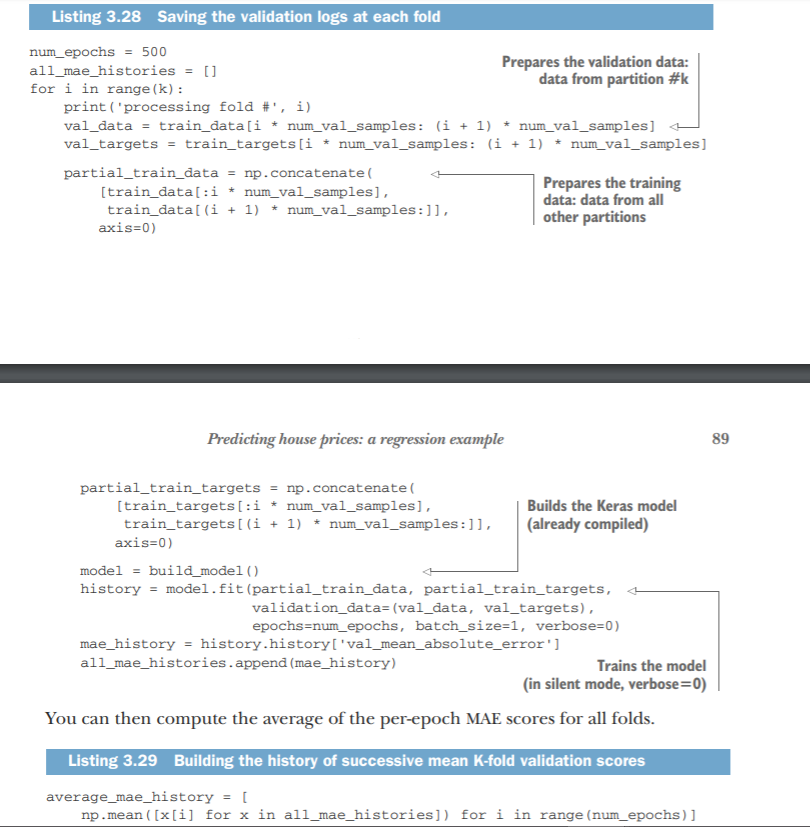

# Neural Networks and Common ML Scenarios

NN Consists of :
- Layers, which are combined into a network (or model)
- The input data and corresponding targets
- The loss function, which defines the feedback signal used for learning
- The optimizer, which determines how learning proceeds

## Neural Nets : Layers
- Layers: the building blocks of deep learning
-  A layer is a data-processing module that takes as input one or more tensors and that outputs one or more tensors. Some layers are stateless, but more frequently layers have a state: the layer’s weights, one or several tensors learned with stochastic gradient descent, which together contain the network’s knowledge.

### Layers 

-  simple vector data, stored in 2D tensors of shape (samples, features), is often processed by densely connected layers, also called fully connected or dense layers (the Dense class in Keras).
-  Sequence data, stored in 3D tensors of shape (samples, timesteps, features), is typically processed by recurrent layers such as an LSTM layer.
- Image data, stored in 4D tensors, is usually processed by 2D convolution layers (Conv2D).


## Neural Nets : Models 
- A deep-learning model is a directed, acyclic graph of layers. The most common instance is a linear stack of layers, mapping a single input to a single output.
- There is  a variety of network topologies. Some Common Ones are:
    - Two-branch networks
    - Multihead networks
    - Inception blocks
-  Picking the right network architecture is more an art than a science

## Neural Nets : Loss functions and optimisers

### Loss function (objective function)
- The quantity that will be minimized during training. It represents a measure of success for the task at hand.


### Optimizer 
- Determines how the network will be updated based on the loss function. It implements a specific variant of stochastic gradient descent (SGD).

A neural network that has multiple outputs may have multiple loss functions (one per
output). But the gradient-descent process must be based on a single scalar loss value;
so, for multiloss networks, all losses are combined (via averaging) into a single scalar
quantity.

___Choosing the right objective function for the right problem is extremely important: your network will take any shortcut it can, to minimize the loss; so if the objective
doesn’t fully correlate with success for the task at hand, your network will end up
doing things you may not have wanted. Imagine a stupid, omnipotent AI trained via
SGD, with this poorly chosen objective function: “maximizing the average well-being
of all humans alive.” To make its job easier, this AI might choose to kill all humans
except a few and focus on the well-being of the remaining ones—because average
well-being isn’t affected by how many humans are left. That might not be what you
intended! Just remember that all neural networks you build will be just as ruthless in
lowering their loss function—so choose the objective wisely, or you’ll have to face
unintended side effects.___

## About Using Keras

- Define your training data: input tensors and target tensors.
- Define a network of layers (or model ) that maps your inputs to your targets.
- Configure the learning process by choosing a loss function, an optimizer, and some metrics to monitor.
- Iterate on your training data by calling the fit() method of your model.

There are two ways to define a model: using the Sequential class (only for linear
stacks of layers, which is the most common network architecture by far) or the functional API (for directed acyclic graphs of layers, which lets you build completely arbitrary architectures).

>  [AWS EC2 GPU](https://aws.amazon.com/amazonai/amis) instance or on Google Cloud Platform

## Two-Class classification 

Two-class classification, or binary classification, may be the most widely applied kind
of machine-learning problem.

Steps:
1. Preparing the data
1. Building your network
    - About Layers        
        -  There are two key architecture decisions to be made about such a stack of Dense layers:
            - How many layers to use
            - How many hidden units to choose for each layer
    - Choosing activation functions
    - Choosing loss function and optimiser
    
1. Validating Approach
1. Using trained network to generate predictions on new data

### What are activation functions, and why are they necessary?

Without an activation function like relu (also called a non-linearity), the Dense layer
would consist of two linear operations—a dot product and an addition:
```
output = dot(W, input) + b
```
So the layer could only learn linear transformations (affine transformations) of the
input data: the hypothesis space of the layer would be the set of all possible linear
transformations of the input data into a 16-dimensional space. Such a hypothesis
space is too restricted and wouldn’t benefit from multiple layers of representations,
because a deep stack of linear layers would still implement a linear operation: adding
more layers wouldn’t extend the hypothesis space.
In order to get access to a much richer hypothesis space that would benefit from
deep representations, you need a non-linearity, or activation function. relu is the
most popular activation function in deep learning, but there are many other candidates, which all come with similarly strange names: prelu, elu, and so on.


>  you need to choose a loss function and an optimizer. Because you’re facing a
binary classification problem and the output of your network is a probability (you end
your network with a single-unit layer with a sigmoid activation), it’s best to use the binary_crossentropy loss. It isn’t the only viable choice: you could use, for instance,
mean_squared_error. But crossentropy is usually the best choice when you’re dealing
with models that output probabilities. Crossentropy is a quantity from the field of Information Theory that measures the distance between probability distributions or, in this
case, between the ground-truth distribution and your predictions.

### Points To Consider
- You usually need to do quite a bit of preprocessing on your raw data in order to be able to feed it—as tensors—into a neural network. Sequences of words can be encoded as binary vectors, but there are other encoding options, too.
- Stacks of Dense layers with relu activations can solve a wide range of problems (including sentiment classification), and you’ll likely use them frequently.
- In a binary classification problem (two output classes), your network should end with a Dense layer with one unit and a sigmoid activation: the output of your network should be a scalar between 0 and 1, encoding a probability.
- With such a scalar sigmoid output on a binary classification problem, the loss function you should use is binary_crossentropy.
- The rmsprop optimizer is generally a good enough choice, whatever your problem. That’s one less thing for you to worry about.
- As they get better on their training data, neural networks eventually start overfitting and end up obtaining increasingly worse results on data they’ve never seen before. Be sure to always monitor performance on data that is outside of the training set. 

## Multiclass Classification

- To vectorize the labels, there are two possibilities: you can cast the label list as an integer tensor, or you can use one-hot encoding. One-hot encoding is a widely used format for categorical data, also called categorical encoding

```python
from keras.utils.np_utils import to_categorical
one_hot_train_labels = to_categorical(train_labels)
one_hot_test_labels = to_categorical(test_labels)
```

- a 16-dimensional space may be too limited to learn to separate 46 different classes: such small layers may act as information bottlenecks, permanently dropping relevant information. For this reason you’ll use larger layers. Let’s go with 64 units.

- The best loss function to use in this case is categorical_crossentropy. It measures the distance between two probability distributions: here, between the probability distribution output by the network and the true distribution of the labels. By minimizing the distance between these two distributions, you train the network to output something as close as possible to the true labels.

- If you’re trying to classify data points among N classes, your network should end with a Dense layer of size N.
- In a single-label, multiclass classification problem, your network should end with a softmax activation so that it will output a probability distribution over the N output classes.
- Categorical crossentropy is almost always the loss function you should use for such problems. It minimizes the distance between the probability distributions output by the network and the true distribution of the targets.
-  There are two ways to handle labels in multiclass classification:
-  Encoding the labels via categorical encoding (also known as one-hot encoding) and using categorical_crossentropy as a loss function
-  Encoding the labels as integers and using the sparse_categorical_crossentropy loss function
-  If you need to classify data into a large number of categories, you should avoid creating information bottlenecks in your network due to intermediate layers that are too small. 

## Regression

### Preparing the data

It would be problematic to feed into a neural network values that all take wildly different ranges. The network might be able to automatically adapt to such heterogeneous
data, but it would definitely make learning more difficult. A widespread best practice
to deal with such data is to do feature-wise normalization: for each feature in the input
data (a column in the input data matrix), you subtract the mean of the feature and
divide by the standard deviation, so that the feature is centered around 0 and has a
unit standard deviation. This is easily done in Numpy.

### Building network

- Because so few samples are available, you’ll use a very small network with two hidden layers, each with 64 units. In general, the less training data you have, the worse overfitting will be, and using a small network is one way to mitigate overfitting.

```python
from keras import models
from keras import layers
def build_model():
model = models.Sequential()
model.add(layers.Dense(64, activation='relu',
input_shape=(train_data.shape[1],)))
model.add(layers.Dense(64, activation='relu'))
model.add(layers.Dense(1))
model.compile(optimizer='rmsprop', loss='mse', metrics=['mae'])
return model
```

- you compile the network with the mse loss function—mean squared error, the square of the difference between the predictions and the targets. This is a widely used loss function for regression problems.

-  You’re also monitoring a new metric during training: mean absolute error (MAE). It’s the absolute value of the difference between the predictions and the targets. 


### Validating using K-fold Validation

To evaluate your network while you keep adjusting its parameters (such as the number
of epochs used for training), you could split the data into a training set and a validation set, as you did in the previous examples. But because you have so few data points,
the validation set would end up being very small (for instance, about 100 examples).
As a consequence, the validation scores might change a lot depending on which data
points you chose to use for validation and which you chose for training: the validation
scores might have a high variance with regard to the validation split. This would prevent you from reliably evaluating your model.


-  The best practice in such situtions is to use K-fold cross-validation

- It consists of splitting the available data into K partitions (typically K = 4 or 5), instantiating K identical models, and training each one on K – 1 partitions while evaluating on the remaining partition. The validation score for the model used is then the average of the K validation scores obtained.


-  Regression is done using different loss functions than what we used for classification. Mean squared error (MSE) is a loss function commonly used for regression.
- Similarly, evaluation metrics to be used for regression differ from those used for classification; naturally, the concept of accuracy doesn’t apply for regression. A common regression metric is mean absolute error (MAE).
- When features in the input data have values in different ranges, each feature should be scaled independently as a preprocessing step.
- When there is little data available, using K-fold validation is a great way to reliably evaluate a model.
-  When little training data is available, it’s preferable to use a small network with few hidden layers (typically only one or two), in order to avoid severe overfitting


Cool Validation Technique




- You’ll usually need to preprocess raw data before feeding it into a neural network.
- When your data has features with different ranges, scale each feature independently as part of preprocessing.
- As training progresses, neural networks eventually begin to overfit and obtain worse results on never-before-seen data.
- If you don’t have much training data, use a small network with only one or two hidden layers, to avoid severe overfitting.
- If your data is divided into many categories, you may cause information bottlenecks if you make the intermediate layers too small.
- Regression uses different loss functions and different evaluation metrics than classification.
- When you’re working with little data, K-fold validation can help reliably evaluate your model.
