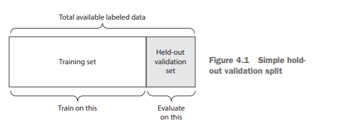
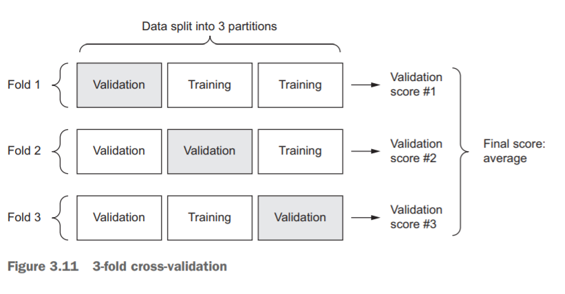
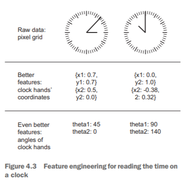
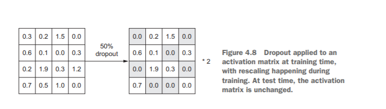

# Neural Networks and Fundamentals of ML


## Four Branches of ML

### Supervised Learning

This is by far the most common case. It consists of learning to map input data to
known targets (also called annotations), given a set of examples (often annotated by
humans). Generally, almost all applications of deep learning
that are in the spotlight these days belong in this category, such as optical character
recognition, speech recognition, image classification, and language translation.

 Although supervised learning mostly consists of classification and regression, there
are more exotic variants as well, including the following (with examples):
- Sequence generation—Given a picture, predict a caption describing it. Sequence generation can sometimes be reformulated as a series of classification problems (such as repeatedly predicting a word or token in a sequence).
- Syntax tree prediction—Given a sentence, predict its decomposition into a syntax tree.
- Object detection—Given a picture, draw a bounding box around certain objects inside the picture. This can also be expressed as a classification problem (given many candidate bounding boxes, classify the contents of each one) or as a joint classification and regression problem, where the bounding-box coordinates are predicted via vector regression.
- Image segmentation—Given a picture, draw a pixel-level mask on a specific object. 


### Unsupervised Learning

This branch of machine learning consists of finding interesting transformations of the
input data without the help of any targets, for the purposes of data visualization, data
compression, or data denoising, or to better understand the correlations present in
the data at hand. Unsupervised learning is the bread and butter of data analytics, and
it’s often a necessary step in better understanding a dataset before attempting to solve
a supervised-learning problem. Dimensionality reduction and clustering are well-known
categories of unsupervised learning. 


### Self-Supervised Learning

 Self-supervised learning is supervised learning without human-annotated labels—you can think of it as supervised learning without any
humans in the loop. There are still labels involved (because the learning has to be
supervised by something), but they’re generated from the input data, typically using a
heuristic algorithm.


### Reinforcement learning

 In reinforcement learning,
an agent receives information about its environment and learns to choose actions that
will maximize some reward. For instance, a neural network that “looks” at a videogame screen and outputs game actions in order to maximize its score can be trained
via reinforcement learning.
 Currently, reinforcement learning is mostly a research area and hasn’t yet had significant practical successes beyond games.

##  ML Specific Definitions

- Sample or input—One data point that goes into your model.
- Prediction or output—What comes out of your model.
- Target—The truth. What your model should ideally have predicted, according to an external source of data Prediction error or loss value—A measure of the distance between your model’s prediction and the target.
- Classes—A set of possible labels to choose from in a classification problem. For example, when classifying cat and dog pictures, “dog” and “cat” are the two classes.
- Label—A specific instance of a class annotation in a classification problem. For instance, if picture #1234 is annotated as containing the class “dog,” then “dog” is a label of picture #1234.
- Ground-truth or annotations—All targets for a dataset, typically collected by humans.
- Binary classification—A classification task where each input sample should be categorized into two exclusive categories.
- Multiclass classification—A classification task where each input sample should be categorized into more than two categories: for instance, classifying handwritten digits.
- Multilabel classification—A classification task where each input sample can be assigned multiple labels. For instance, a given image may contain both a cat and a dog and should be annotated both with the “cat” label and the “dog” label. The number of labels per image is usually variable.
- Scalar regression—A task where the target is a continuous scalar value. Predicting house prices is a good example: the different target prices form a continuous space.
- Vector regression—A task where the target is a set of continuous values: for example, a continuous vector. If you’re doing regression against multiple values (such as the coordinates of a bounding box in an image), then you’re doing vector regression.
- Mini-batch or batch—A small set of samples (typically between 8 and 128) that are processed simultaneously by the model. The number of samples is often a power of 2, to facilitate memory allocation on GPU. When training, a mini-batch is used to compute a single gradient-descent update applied to the weights of the model. 

## Evaluating Machine Learning Models

Evaluating a model always boils down to splitting the available data into three sets:
training, validation, and test. You train on the training data and evaluate your model
on the validation data. Once your model is ready for prime time, you test it one final
time on the test data
Out of all there are three classic evaluation recipes:
- simple hold-out validation
- Kfold validation
- iterated K-fold validation with shuffling.

### Simple Hold-Out Validation

Set apart some fraction of your data as your test set. Train on the remaining data, and
evaluate on the test set.In order to prevent information leaks, you shouldn’t tune your model based on the test set, and therefore you
should also reserve a validation set.




### K-Fold Validation

With this approach, you split your data into K partitions of equal size. For each partition i, train a model on the remaining K – 1 partitions, and evaluate it on partition i.
Your final score is then the averages of the K scores obtained. This method is helpful
when the performance of your model shows significant variance based on your traintest split.



### Iterated K-Fold Validation

This one is for situations in which you have relatively little data available and you need
to evaluate your model as precisely as possible. I’ve found it to be extremely helpful in
Kaggle competitions. It consists of applying K-fold validation multiple times, shuffling
the data every time before splitting it K ways. The final score is the average of the
scores obtained at each run of K-fold validation. Note that you end up training and
evaluating P × K models (where P is the number of iterations you use), which can very
expensive.

### Important Points

- Data representativeness—You want both your training set and test set to be representative of the data at hand. For instance, if you’re trying to classify images of digits, and you’re starting from an array of samples where the samples are ordered by their class, taking the first 80% of the array as your training set and the remaining 20% as your test set will result in your training set containing only classes 0–7, whereas your test set contains only classes 8–9. This seems like a ridiculous mistake, but it’s surprisingly common. For this reason, you usually should randomly shuffle your data before splitting it into training and test sets.
- The arrow of time—If you’re trying to predict the future given the past (for example, tomorrow’s weather, stock movements, and so on), you should not randomly shuffle your data before splitting it, because doing so will create a temporal leak: your model will effectively be trained on data from the future. In such situations, you should always make sure all data in your test set is posterior to the data in the training set
- Redundancy in your data—If some data points in your data appear twice (fairly common with real-world data), then shuffling the data and splitting it into a training set and a validation set will result in redundancy between the training and validation sets. In effect, you’ll be testing on part of your training data, which is the worst thing you can do! Make sure your training set and validation set are disjoint. 


## Data preprocessing, feature engineering, and feature learning

### Data Preprocessing for NNs

#### Vectorisation
All inputs and targets in a neural network must be tensors of floating-point data (or, in
specific cases, tensors of integers). Whatever data you need to process—sound,
images, text—you must first turn into tensors, a step called data vectorization.

#### Value Normalisation

It isn’t safe to feed into a neural network data that takes relatively large values (for example, multidigit integers, which are much larger than the initial values taken
by the weights of a network) or data that is heterogeneous (for example, data where one
feature is in the range 0–1 and another is in the range 100–200). Doing so can trigger
large gradient updates that will prevent the network from converging. To make learning
easier for your network, your data should have the following characteristics:

- Take small values—Typically, most values should be in the 0–1 range
- Be homogenous—That is, all features should take values in roughly the same range.
- (Stricter) Normalize each feature independently to have a mean of 0.
- (Stricter) Normalize each feature independently to have a standard deviation of 1.

```python
x -= x.mean(axis=0)
x /= x.std(axis=0)
```

>  In general, with neural networks, it’s safe to input missing values as 0, with the condition that 0 isn’t already a meaningful value. The network will learn from exposure to
the data that the value 0 means missing data and will start ignoring the value.
 Note that if you’re expecting missing values in the test data, but the network was
trained on data without any missing values, the network won’t have learned to ignore
missing values! In this situation, you should artificially generate training samples with
missing entries: copy some training samples several times, and drop some of the features that you expect are likely to be missing in the test data. 

### Feature Engineering

Feature engineering is the process of using your own knowledge about the data and about
the machine-learning algorithm at hand (in this case, a neural network) to make the
algorithm work better by applying
hardcoded (nonlearned) transformations to the data before it goes
into the model.



 Before deep learning, feature engineering used to be critical, because classical
shallow algorithms didn’t have hypothesis spaces rich enough to learn useful features
by themselves. The way you presented the data to the algorithm was essential to its success. For instance, before convolutional neural networks became successful on the
MNIST digit-classification problem, solutions were typically based on hardcoded features such as the number of loops in a digit image, the height of each digit in an
image, a histogram of pixel values, and so on.
 Fortunately, modern deep learning removes the need for most feature engineering, because neural networks are capable of automatically extracting useful features
from raw data. Does this mean you don’t have to worry about feature engineering as
long as you’re using deep neural networks? No, for two reasons:

- Good features still allow you to solve problems more elegantly while using fewer resources. For instance, it would be ridiculous to solve the problem of reading a clock face using a convolutional neural network.
- Good features let you solve a problem with far less data. The ability of deeplearning models to learn features on their own relies on having lots of training data available; if you have only a few samples, then the information value in their features becomes critical


## Overfitting and Underfitting

The fundamental issue in machine learning is the tension between optimization
and generalization. Optimization refers to the process of adjusting a model to get the
best performance possible on the training data (the learning in machine learning),
whereas generalization refers to how well the trained model performs on data it has
never seen before.

At the beginning of training, optimization and generalization are correlated: the
lower the loss on training data, the lower the loss on test data. While this is happening,
your model is said to be underfit: there is still progress to be made; the network hasn’t
yet modeled all relevant patterns in the training data. But after a certain number of
iterations on the training data, generalization stops improving, and validation metrics
stall and then begin to degrade: the model is starting to overfit. That is, it’s beginning
to learn patterns that are specific to the training data but that are misleading or irrelevant when it comes to new data.

- To prevent a model from learning misleading or irrelevant patterns found in the training data, the best solution is to get more training data.
- modulate the quantity of information that your model is allowed to store or to add constraints on what information it’s allowed to store. If a network can only afford to memorize a small number of patterns, the optimization process will force it to focus on the most prominent patterns, which have a better chance of generalizing well.

The processing of fighting overfitting this way is called __regularization__.

### Regularisation : Reducing the network’s size


The simplest way to prevent overfitting is to reduce the size of the model: the number
of learnable parameters in the model (which is determined by the number of layers
and the number of units per layer).
__The number of learnable parameters in a model is often referred to as the model’s capacity.__

>  Always keep this in mind: deeplearning models tend to be good at fitting to the training data, but the real challenge
is generalization, not fitting.

___There is
a compromise to be found between too much capacity and not enough capacity.___

### Regularisation: Adding Weight Regularisation

 A simple model in this context is a model where the distribution of parameter values
has less entropy (or a model with fewer parameters, as you saw in the previous section). Thus a common way to mitigate overfitting is to put constraints on the complexity of a network by forcing its weights to take only small values, which makes the
distribution of weight values more regular. This is called weight regularization, and it’s
done by adding to the loss function of the network a cost associated with having large
weights. This cost comes in two flavors:
- L1 regularization—The cost added is proportional to the absolute value of the weight coefficients (the L1 norm of the weights).
- L2 regularization—The cost added is proportional to the square of the value of the weight coefficients (the L2 norm of the weights). L2 regularization is also called weight decay in the context of neural networks. Don’t let the different name confuse you: weight decay is mathematically the same as L2 regularization.

```python

from keras import regularizers
model = models.Sequential()
model.add(layers.Dense(16, kernel_regularizer=regularizers.l2(0.001),
activation='relu', input_shape=(10000,)))
model.add(layers.Dense(16, kernel_regularizer=regularizers.l2(0.001),
activation='relu'))
model.add(layers.Dense(1, activation='sigmoid'))

from keras import regularizers
regularizers.l1(0.001)
regularizers.l1_l2(l1=0.001, l2=0.001)

```

### Regularisation : Adding a dropout

Dropout is one of the most effective and most commonly used regularization techniques for neural networks.

 Dropout, applied to a layer, consists of randomly dropping out
(setting to zero) a number of output features of the layer during training. Let’s say a
given layer would normally return a vector [0.2, 0.5, 1.3, 0.8, 1.1] for a given input
sample during training. After applying dropout, this vector will have a few zero entries
distributed at random: for example, [0, 0.5, 1.3, 0, 1.1]. The dropout rate is the fraction
of the features that are zeroed out; it’s usually set between 0.2 and 0.5. At test time, no
units are dropped out; instead, the layer’s output values are scaled down by a factor
equal to the dropout rate, to balance for the fact that more units are active than at
training time.


```python

model = models.Sequential()
model.add(layers.Dense(16, activation='relu', input_shape=(10000,)))
model.add(layers.Dropout(0.5))
model.add(layers.Dense(16, activation='relu'))
model.add(layers.Dropout(0.5))
model.add(layers.Dense(1, activation='sigmoid'))
```


__Summarised:__
- __Get more training data.__
- __Reduce the capacity of the network.__
- __Add weight regularization.__
- __Add dropout.__

